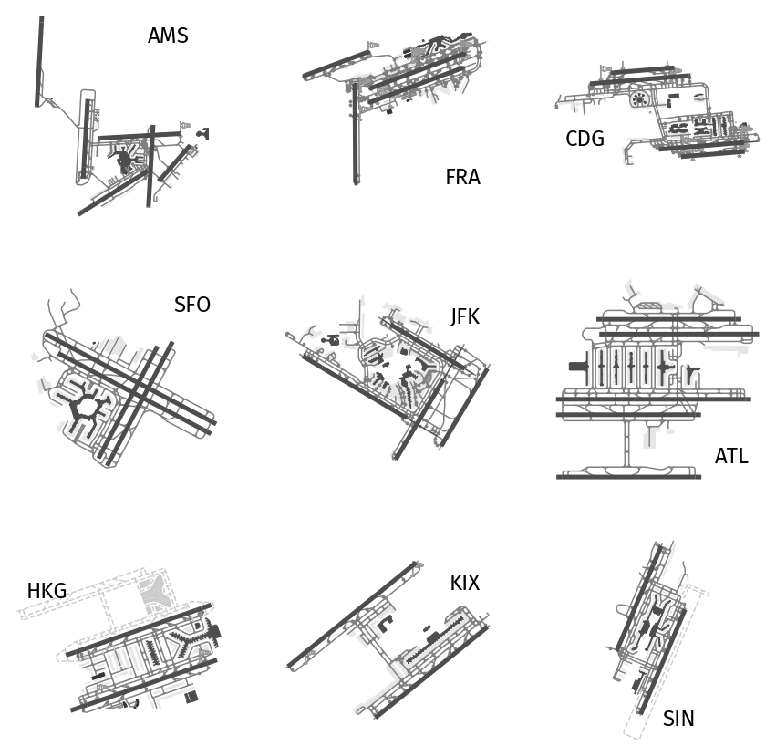

Airport layouts
===============

Data acquisition
----------------

Download nodes, ways and relations with the ``aeroway`` tag within area marked with various IATA codes. Here in order: Amsterdam, Frankfurt, Paris, San Francisco, New York, Atlanta, Hong-Kong, Osaka Kansai and Singapore.

.. code:: python

    from cartes.osm import Overpass

    airport = Overpass.request(area=dict(iata=iata), aeroway=True)

Data preprocessing
------------------

None

Data visualisation
------------------

.. code:: python

    import matplotlib.pyplot as plt
    from cartes.crs import Mercator

    fig, ax = plt.subplots(
        3, 3, figsize=(15, 15),
        subplot_kw=dict(projection=Mercator())
    )

    locs = dict(AMS=1, FRA=4, CDG=3, SFO=1, JFK=1, ATL=4, HKG=2, KIX=1, SIN=4)

    for ax_, iata in zip(ax.ravel(), locs.keys()):

        # Download data (or get from cache)
        airport = Overpass.request(area=dict(iata=iata), aeroway=True)

        airport.plot(
            ax_,
            by="aeroway",
            # Adjust some colors for this scale
            gate=dict(alpha=0),  # mute
            parking_position=dict(alpha=0),  # mute
            tower=dict(markersize=500),  # reduce
            jet_bridge=dict(color="0.3"),  # change color
            navigationaid=dict(papi=dict(alpha=0)),  # mute
        )
        ax_.spines["geo"].set_visible(False)

        text = AnchoredText(
            iata, loc=locs[iata], frameon=False,
            prop={"size": 24, "fontname": "Fira Sans"},
        )
        ax_.add_artist(text)