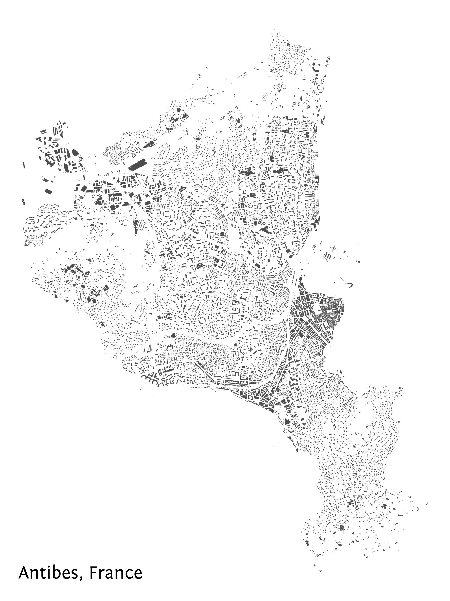

Building footprints in a given city
===================================

Data acquisition
----------------

Download nodes, ways and relations inside the area named Antibes (city in the French riviera) with a ``building`` tag.

.. code:: python

    from cartes.osm import Overpass

    antibes = Overpass.request(area="Antibes", building=True)

Data preprocessing
------------------

None

Data visualisation
------------------

.. code:: python

    from cartes.crs import Lambert93

    import matplotlib.pyplot as plt
    from matplotlib.offsetbox import AnchoredText

    fig, ax = plt.subplots(
        figsize=(50, 50),
        subplot_kw=dict(projection=Lambert93())
    )

    antibes.plot(ax=ax, by="building", building=dict(color="0.3"))
    ax.spines["geo"].set_visible(False)

    text = AnchoredText(
        "Antibes, France", loc=3, frameon=False,
        prop={"size": 84, "fontname": "Fontin Sans"},
    )
    ax.add_artist(text)
