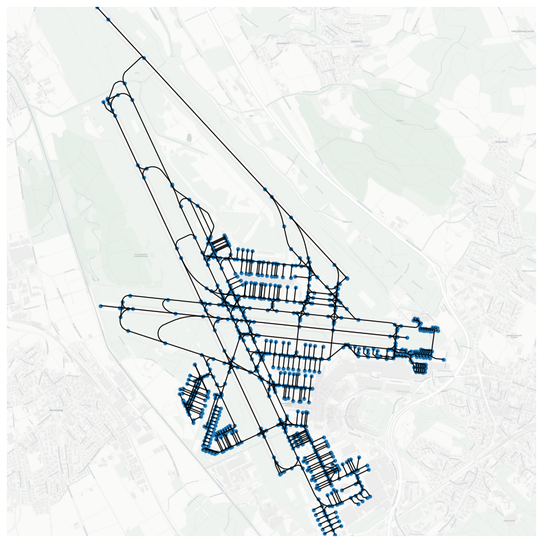

Graphs view for airports
========================

Data acquisition
----------------

Download nodes, ways and relations with the ``aeroway`` tag within area marked with ICAO code for Zurich airport.

.. code:: python

    from cartes.osm import Overpass
    airport = Overpass.request(
        area={"icao": "LSZH", "as_": "airport"},
        nwr=[dict(aeroway=True, area="airport")],
    )

Data preprocessing
------------------

Build a graph from the airport data, using elements with tags ``geometry``, ``aeroway``, ``parking_position`` and ``holding_position``.

.. code:: python

    graph =  airport.network_graph(
        "geometry",
        "aeroway",
        "parking_position",
        "holding_position",
        "ref",
        "name",
        query_str='aeroway == "taxiway" or aeroway == "runway" or '
        'aeroway == "parking_position" or aeroway == "holding_position"',
    )

Data visualisation
------------------

.. code:: python

    import matplotlib.pyplot as plt

    from cartes import tiles
    from cartes.crs import PlateCarree, Mercator

    fig, ax = plt.subplots(
        figsize=(10, 10),
        subplot_kw=dict(projection=Mercator.GOOGLE),
    )

    for u, v, data in graph.edges(data=True):
        ax.add_geometries(
            [data["geometry"]],
            crs=PlateCarree(),
            facecolor="none",
            edgecolor="black",
        )

    pos = dict((node, data["pos"]) for (node, data) in graph.nodes(data=True))
    lon_, lat_ = zip(*pos.values())
    ax.scatter(lon_, lat_, s=10, transform=PlateCarree())

    tiles_ = tiles.Basemaps(variant="light_all")
    ax.add_image(tiles_, 16)

    ax.set_extent(airport, buffer=0)
    ax.set_square_ratio(crs=projection)
    ax.spines["geo"].set_visible(False)
