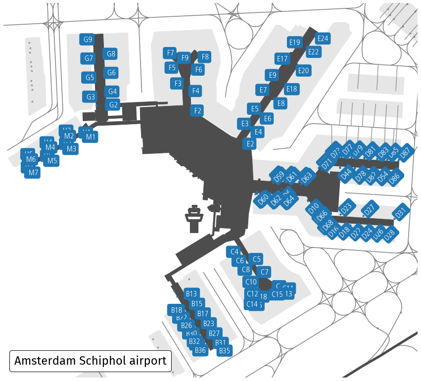

Airport terminal layouts
========================

Data acquisition
----------------

Download nodes, ways and relations with the ``aeroway`` tag within area marked with IATA code ``AMS`` (Amsterdam airport). The ICAO code (here ``EHAM``) may also be used.

.. code:: python

    from cartes.osm import Overpass

    airport = Overpass.request(area=dict(iata="AMS"), aeroway=True)

Data preprocessing
------------------

None

Data visualisation
------------------

.. code:: python

    import matplotlib.pyplot as plt
    from matplotlib.offsetbox import AnchoredText

    from cartes.crs import Amersfoort, PlateCarree
    
    fig, ax = plt.subplots(
        figsize=(15, 15),
        subplot_kw=dict(projection=Amersfoort())
    )
    
    airport.plot(
        ax, by="aeroway",
        gate=dict(color="C0"),  # change default color for gates to C0 blue
        tower=dict(markersize=3000)  # enlarge default size
    )
    ax.spines["geo"].set_visible(False)

    # Focus on the terminal area (gates), with a little buffer (in terms of lat/lon degrees)
    ax.set_extent(airport.query('aeroway=="gate"'), buffer=1e-3)
    
    
    # This is about some semi-automatic placement of text labels

    def horizontal(name):
        if name[0] in "BCMH":
            if int(name[-1]) & 1 == 0: return "right"
        if name[0] in "EFG":
            if int(name[-1]) & 1 == 1: return "right"
        return "left"
    
    
    def vertical(name):
        if name[0] in " D":
            if int(name[-1]) & 1 == 1: return "bottom"
        if name[0] in "MH":
            if int(name[-1]) & 1 == 0: return "bottom"
        return "top"
    
    
    style = dict(
        transform=PlateCarree(),
        color="white", fontsize=16,
        fontweight="bold", font="Frutiger",  # what else?
        bbox=dict(facecolor="C0", edgecolor="none", boxstyle="round"),
    )
    
    for _, elt in airport.query('aeroway == "gate"').data.iterrows():
        if elt.ref == elt.ref:
            ax.text(
                elt.longitude, elt.latitude, elt.ref.center(3),
                ha=horizontal(elt.ref), va=vertical(elt.ref),
                rotation=45 if elt.ref[0] == "D" else 0, **style
            )

    # Title of the map
    
    text = AnchoredText(
        "Amsterdam Schiphol airport",
        loc=3,
        prop={"size": 24, "fontname": "Fira Sans", },
        frameon=True,
    )
    text.patch.set_boxstyle("round,pad=0.,rounding_size=0.2")
    ax.add_artist(text)
        